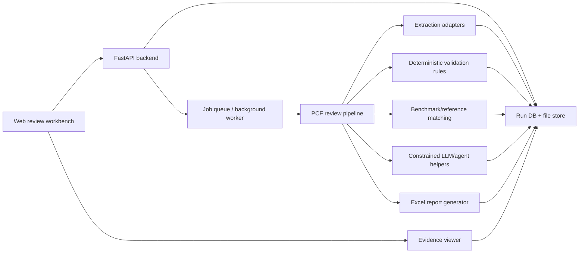

# Technical Solution Scaffold: Supplier PCF Review Assistant

## Recommendation Summary

Build the MVP as a local-first web workbench backed by an explicit Python
review pipeline. The website should support multi-file upload, run progress,
review history, evidence inspection, and Excel-compatible export. The backend
should combine deterministic parsers with constrained LLM/agent document
understanding: document text/table extraction and candidate field mapping may
use the best available deterministic or AI-assisted tools, while typed schemas,
evidence requirements, validation gates, normalization, rule checks,
calculations, decisions, and report generation keep the workflow reproducible
and auditable.

Recommended MVP shape:

- Frontend: React/Next.js-style review workbench.
- Backend: Python FastAPI service.
- Processing: explicit job pipeline with stage-level status.
- Storage: local filesystem plus typed JSON artifacts for the earliest
  prototype; add SQLite when the website needs filtering/history APIs;
  PostgreSQL/object storage later.
- Agent use: schema-constrained substeps for document understanding and
  ambiguity handling, never the final authority for compliance decisions.
- Upload mode: multi-file upload first; cloud-folder ingestion later.

## Single Upload vs Cloud Folder

### MVP Recommendation: Multi-File Upload

Start with upload from the website: individual files, many files, or a zip. This
matches the demo need and the stakeholder expectation of 100 to 200 files per
run without adding enterprise folder permissions, sync state, or document
governance work.

Benefits:

- Fastest to build and demo.
- Clear run boundary: one upload batch equals one review run.
- Easy to preserve source file identity, hash, evidence, and output.
- Works locally with anonymized or synthetic files.

### Later Option: Cloud Folder / Watch Folder

Add a folder connector after the core pipeline works. Good candidates:

- Local watched folder for a simple on-premise-style prototype.
- SharePoint/OneDrive or Google Drive if the stakeholder workflow already lives
  there.
- Supabase Storage, S3, or MinIO for application-managed object storage.

Cloud-folder ingestion should create review runs from newly detected files,
preserve source location, and avoid overwriting old reviews. Do not build this
first unless the demo specifically needs hands-off ingestion.

## Proposed Tech Stack

### Frontend

Recommended:

- React with Next.js App Router or Vite.
- TypeScript for typed API contracts.
- TanStack Table or AG Grid Community for the detailed review grid.
- PDF.js for evidence viewing in PDF documents.
- SheetJS only if client-side spreadsheet preview is useful; keep actual Excel
  parsing and report generation in Python.

Next.js is useful if the team wants a full-stack web shell with route handlers,
server components, and deployment options. A Vite React app is simpler if the
backend is always a separate Python service.

### Backend and Processing

Recommended:

- FastAPI for upload, run orchestration, status endpoints, and downloads.
- Pydantic models for canonical records and structured LLM outputs.
- File-first persistence for the first spike: Excel/CSV reference inputs,
  original uploaded files, and typed JSON intermediate artifacts.
- SQLite plus SQLModel once the web UI needs run history, filtering, detail
  pages, and stable API queries.
- Local filesystem for uploaded files, extracted text, intermediate JSON, and
  generated reports.
- FastAPI `BackgroundTasks` only for demo/simple local runs.
- RQ or Celery once jobs need worker restarts, retries, or multiple workers.

## File-First Data Strategy

Yes, it makes sense to start with Excel/CSV files as the first "database" for
reference data and simple demos. This matches the stakeholder workflow and keeps
the MVP easy to inspect. The important boundary is that Excel/CSV should be an
input/export format, not the only internal state format.

Recommended MVP persistence layers:

| Data type | First format | Why |
| --- | --- | --- |
| Supplier source files | Original file copy | Preserves audit evidence and reprocessing ability. |
| Benchmark/reference data | Excel or CSV | Matches current BAFU/internal export expectation. |
| Extracted raw text/tables | JSON plus optional `.txt`/`.md` preview | JSON is machine-readable; preview helps debugging. |
| Canonical extracted records | JSON validated by Pydantic/JSON Schema | Stable, testable, and safe for deterministic rules. |
| Requirement check results | JSON validated by schema | One source for UI, report, and audit history. |
| Match candidates | JSON validated by schema | Keeps top match, alternatives, confidence, and uncertainty. |
| Final user output | XLSX first, CSV optional | Excel-compatible file is the stakeholder-facing artifact. |
| Human-readable summaries | Markdown optional | Useful for demo/debugging, not the source of truth. |

Practical rule: store machine state in JSON, display/export in Excel/CSV/HTML,
and keep Markdown only as a readable companion.

### Where Scraped PDF / Other-Source Data Goes

For each uploaded document, create an artifact folder:

```text
runs/
  {review_run_id}/
    inputs/
      original/
        Supplier_5_Phenol_PCF.pdf
    extracted/
      Supplier_5_Phenol_PCF.raw_text.txt
      Supplier_5_Phenol_PCF.tables.json
      Supplier_5_Phenol_PCF.chunks.json
      Supplier_5_Phenol_PCF.extraction_candidates.json
    records/
      pcf_review_records.json
      requirement_checks.json
      match_candidates.json
      decisions.json
    reports/
      review_results.xlsx
      review_results.csv
      summary.md
```

Use JSON for extracted PDF data because every downstream step needs structure:
page number, table number, row/column position, snippet, extraction method, and
confidence. Markdown is helpful for quick human review, but it loses too much
structure to be the internal handoff format.

### Schema Requirement

The project should define schemas before writing the output CSV/XLSX. The schema
does not need to be heavy, but the pipeline needs one stable contract for:

- canonical PCF review records,
- requirement check rows,
- benchmark/reference match candidates,
- evidence references,
- final report rows.

Recommended implementation:

- Define Pydantic models in Python.
- Generate JSON Schema from those models if needed for agents or validation.
- Use the same models to validate deterministic extraction outputs and LLM
  structured outputs.
- Treat schema population as a controlled boundary: agents may propose field
  candidates with evidence, but Pydantic validation, enum/status normalization,
  unit conversion, rule checks, and decision logic happen after the proposal.
- Generate final CSV/XLSX columns from an explicit `ReportRow` schema, not from
  whatever keys happen to appear during extraction.

This prevents column drift, makes tests straightforward, and keeps the final
Excel file audit-friendly.

### Document and Data Tooling

Recommended deterministic tools:

- `pandas` for tabular data loading and shaping.
- `openpyxl` for reading existing Excel forms and cell-level evidence.
- `XlsxWriter` or `openpyxl` for generated Excel reports with formatting.
- `PyMuPDF` for PDF text extraction and page-level evidence.
- `Camelot` for text-based PDF table extraction where table structure matters.
- `Docling` as a stronger candidate for mixed PDF layout/table conversion when
  supplier PDFs become important.
- `RapidFuzz` for deterministic fuzzy matching of product names and aliases.
- `pint` or a small explicit unit-normalization module for unit conversion.

Do not require every extraction step to be deterministic. For messy PDFs,
scanned documents, or inconsistent CSV/Excel layouts, the practical target is
repeatable orchestration and verifiable outputs: preserve extracted text/tables,
store the tool or model used, capture evidence spans or cell/page references,
validate every candidate against schemas, and route uncertainty to human review.

### LLM / Agent Tooling

Recommended:

- OpenAI Responses API or OpenAI Agents SDK when using OpenAI models.
- Structured Outputs for schema-constrained extraction/comment results.
- OpenAI Agents SDK tracing if agent runs need observable step history.
- LangGraph if the team wants explicit durable workflow state, human interrupts,
  and graph-style orchestration.
- PydanticAI is a lighter alternative if the main goal is typed structured
  outputs around Python functions.

For this project, avoid a fully autonomous agent as the main controller. Use an
explicit pipeline and invoke agents where document understanding, layout
interpretation, semantic field mapping, or ambiguity handling is genuinely
useful.

### Minimal Agentic Workflow

Use Occam's razor: start with one workflow coordinator in code, not a large
multi-agent organization. The coordinator can be a pipeline/orchestrator service
that decides which deterministic tools and agent tools to call for each stage,
records inputs and outputs, and stops when a schema, evidence, confidence, or
cost boundary is violated.

Recommended first agent roles:

- `ExtractionAgent`: maps messy document text/tables to schema-bound field
  candidates with page, table, cell, or snippet evidence.
- `MatchAgent`: suggests aliases or close benchmark/reference candidates when
  deterministic exact/fuzzy matching is insufficient.
- `CommentAgent`: drafts reviewer comments, supplier follow-up questions, and
  audit summaries from already-computed facts.

Do not start with separate persona agents for procurement, LCA expert,
compliance reviewer, and auditor unless the implementation proves that a single
role-specific prompt becomes too large or contradictory. In the MVP, personas
should usually be prompt sections or task instructions, not independent agents.

Keep agent instructions in versioned prompt files only when they reduce
duplication and make runs more reproducible. A minimal structure is enough:

- `agents/skills.md`: shared project rules, evidence policy, schema policy, and
  domain vocabulary for all agent calls.
- `agents/commands.md`: callable task prompts such as extract fields, suggest
  benchmark matches, draft comment, and draft supplier question.
- `agents/schemas.py`: Pydantic models used by structured outputs.

If using the OpenAI Agents SDK, the coordinator may run these as named tools or
subagents. If using a simpler Responses API or PydanticAI setup, keep the same
conceptual roles as plain functions with prompt templates. The architecture
should not depend on multi-agent complexity for the demo to work.

### Scripts vs Agent Skills and Commands

Use scripts/modules for deterministic workflow steps and use agent
skills/commands for repeatable language-reasoning tasks. A good boundary is:
if the same input must always produce the same output and the output changes
application state, write code; if the task needs semantic interpretation,
summarization, or ambiguous mapping, use a schema-constrained agent command.

Recommended split:

| Need | Use | Why |
| --- | --- | --- |
| File intake, hashing, run IDs, artifact paths | Script/module | Must be repeatable and easy to test. |
| Known Excel form extraction | Script/module | Cell-level mapping can be deterministic and auditable. |
| Unknown workbook layout interpretation | Agent command plus schema validation | Useful when labels move or layouts vary. |
| PDF text/OCR/table conversion | Script/tool wrapper first; agent command for field mapping | Tools preserve page/table evidence; agents help interpret messy text. |
| Unit conversion, date parsing, enum normalization | Script/module | Calculation and normalization must be reproducible. |
| Minimum requirement checks | Script/module | Compliance status must not depend on model wording. |
| Benchmark loading and deviation calculation | Script/module | Numeric comparison must be exact and testable. |
| Alias suggestions and close match rationale | Agent command, optionally after deterministic fuzzy matching | Semantic product matching benefits from language reasoning. |
| Final accept/reject/needs_human_review decision | Script/module | Final decision must be deterministic and explainable. |
| Reviewer comments and supplier questions | Agent command constrained to known facts | Language quality matters, but facts and decision come from code. |
| Report workbook generation | Script/module | Output columns, formatting, and formulas must be stable. |

Options:

- Code-only scripts
  - Pros: reproducible, cheap, testable, easy to audit.
  - Cons: brittle for varied PDFs, unusual language, and moving spreadsheet
    labels.
  - Use for known formats, calculations, rule checks, decisions, and exports.

- Prompt-only commands
  - Pros: fast to iterate, good for messy language and semantic mapping.
  - Cons: harder to regression test, can drift without schemas and stored
    prompts, weaker for numeric correctness.
  - Use only behind Pydantic/JSON Schema validation and evidence requirements.

- Hybrid orchestrated workflow
  - Pros: best balance for this challenge: deterministic backbone with flexible
    document understanding where needed.
  - Cons: requires clear stage contracts and trace logs.
  - Recommended for the MVP.

Do not create a command or skill for every pipeline step. Start with four
agent commands at most: `extract_document_fields`, `suggest_benchmark_match`,
`draft_review_comment`, and `draft_supplier_follow_up`. Everything else should
remain normal Python modules until repetition or prompt drift proves otherwise.

## System Architecture



## Website-to-Workflow Connection

The frontend should connect to the agentic workflow through normal backend job
orchestration. The browser should never call an LLM or autonomous agent
directly.

Recommended flow:

1. User creates a review run in the website.
2. Frontend uploads files to the backend.
3. Backend stores files, creates database records, and returns `review_run_id`.
4. Frontend calls `start` for the run.
5. Backend enqueues a pipeline job.
6. Worker executes deterministic stages and invokes LLM/agent helpers only for
   approved ambiguous substeps.
7. Each stage writes status events, warnings, evidence references, and partial
   records to the database.
8. Frontend polls `GET /api/review-runs/{run_id}` for MVP simplicity, or uses
   server-sent events/WebSockets later for live progress.
9. Frontend loads review rows and evidence from backend APIs.
10. Backend generates and serves the final Excel-compatible report.

This keeps the website simple, makes the workflow auditable, and allows agent
runs to be traced, retried, disabled, or replaced without changing the UI.

## Processing Pipeline

| Step | Deterministic / Controlled Processing | LLM / Agent Use | Output |
| --- | --- | --- | --- |
| 1. Intake | Store files, hash files, assign `review_run_id`, detect file type by extension and content signatures. | None. | `SupplierDocument` records. |
| 2. Classification | Classify known Excel forms, supplier PDFs, EPDs, SDSs, benchmark files, and unrelated files using rules. | Optional only for unknown PDFs. | Document type and confidence. |
| 3. Excel Extraction | Use `openpyxl`/`pandas` to extract fields from known structured supplier forms with cell addresses. | Use only for unknown or inconsistent workbook layouts, and require cell evidence. | Raw extracted fields with evidence. |
| 4. PDF Extraction | Use `PyMuPDF`, `Camelot`, Docling, OCR, or comparable document tools to extract text/tables and page references. | Use for layout interpretation, semantic field mapping, and ambiguous extraction, with evidence snippets and strict schema. | Candidate fields with page/snippet evidence. |
| 5. Normalization | Normalize units, dates, standards, geography, and PCF values to canonical schema. | None, except optional synonym suggestions. | `PcfReviewRecord`. |
| 6. Minimum Checks | Run deterministic requirement checks: pass/fail/missing/not_applicable/uncertain. | None. | Requirement check list. |
| 7. Dataset Presence | Check whether the chemical appears in benchmark/internal reference exports. | Optional synonym/alias suggestions if no exact match. | Presence status and candidate list. |
| 8. Matching | Exact match, alias match, fuzzy match, region/unit/concentration checks. | Invoke only for close-match explanation or semantic candidate ranking. | Top match, alternatives, uncertainty comment. |
| 9. Plausibility | Calculate deviation, apply thresholds, flag very low/high values, preserve regional values. | None for calculation. | Plausibility status and comments. |
| 10. Decision | Apply deterministic decision matrix for accept/reject/needs_human_review. | None. | Final decision and reason codes. |
| 11. Comments | Generate templated decision comments and missing-field notes. | Optional rewrite/polish for supplier-facing follow-up questions, constrained to known facts. | Decision comment and supplier question. |
| 12. Report | Generate Excel-compatible workbook and optional CSV/HTML preview. | None. | Downloadable report and audit record. |

## Where Agents Should Be Invoked

Use agent calls as subroutines with strict inputs and outputs:

1. Ambiguous PDF field extraction
   - Input: document text chunks, table fragments, target schema, evidence rules.
   - Output: structured field candidates with evidence references.
   - Constraint: each extracted value must cite page/snippet/table evidence.

2. Chemical alias and close-match suggestion
   - Input: product name, supplier aliases, benchmark/reference candidates,
     region/unit/concentration metadata.
   - Output: top candidate, alternatives, confidence, uncertainty comment.
   - Constraint: agent may suggest, not confirm, uncertain matches.

3. Decision comment drafting
   - Input: deterministic decision, failed checks, missing fields, deviation
     values, uncertainty flags.
   - Output: short reviewer-facing comment.
   - Constraint: agent cannot alter the decision.

4. Supplier follow-up question
   - Input: missing or unclear fields and source context.
   - Output: copy/paste-ready question for the supplier.
   - Constraint: no unsupported claims or hidden assumptions.

5. Audit narrative
   - Input: final review record and evidence map.
   - Output: short traceability summary.
   - Constraint: must remain grounded in stored record.

## Website Design and Functionality

Design the website as an operational workbench, not a marketing dashboard.

### Screen 1: Review Runs

Purpose: show what has already been checked.

Core elements:

- Run list with date, uploaded file count, processed chemicals, status, and
  export link.
- Filters for active, completed, failed, and needs human review.
- Button to start a new run.

### Screen 2: New Review Run

Purpose: upload a batch and start processing.

Core elements:

- Drag-and-drop multi-file upload.
- Optional zip upload.
- Optional reference dataset upload or selector.
- Pre-run validation: accepted file types, duplicates, size warnings.
- Start review button.

### Screen 3: Run Progress

Purpose: make background processing visible.

Core elements:

- Pipeline stage tracker: intake, extraction, validation, matching,
  plausibility, report.
- Per-file status table.
- Error and warning panel.
- Download links appear when report artifacts are ready.

### Screen 4: Review Grid

Purpose: main working output.

Core elements:

- One row per supplier product or chemical.
- Columns for supplier, product, PCF values, unit, geography, standard,
  requirement status, benchmark match, deviation, decision, decision comment,
  top uncertain match, and supplier follow-up question.
- Filters for reject, needs human review, missing fields, uncertain match, high
  deviation, and no benchmark match.
- Inline status chips: pass, fail, missing, uncertain, not applicable.

### Screen 5: Product Detail and Evidence

Purpose: allow trace-back.

Core elements:

- Extracted field list with original value, normalized value, status, and
  evidence reference.
- Requirement checklist with pass/fail/missing/uncertain comments.
- Benchmark/reference match panel with top candidate and alternatives.
- PDF or Excel evidence viewer.
- Human override/correction placeholder for later phases.

### Screen 6: Reference Data Manager

Purpose: prepare for internal reference data.

Core elements:

- Show loaded BAFU extract or internal Excel reference export.
- Show source version/date.
- Search chemical names and aliases.
- Inspect regional values without averaging.

## API Contract Sketch

```text
POST /api/review-runs
  Create a review run and return review_run_id.

POST /api/review-runs/{run_id}/files
  Upload one or more supplier files.

POST /api/review-runs/{run_id}/start
  Start background processing.

GET /api/review-runs
  List historical runs.

GET /api/review-runs/{run_id}
  Return run metadata and stage status.

GET /api/review-runs/{run_id}/records
  Return normalized review rows for the grid.

GET /api/review-runs/{run_id}/records/{record_id}
  Return detail view, checks, evidence, matches, and comments.

GET /api/review-runs/{run_id}/evidence/{evidence_id}
  Return source evidence metadata or rendered snippet/page reference.

GET /api/review-runs/{run_id}/exports/excel
  Download generated Excel-compatible report.
```

## Canonical Data Model Sketch

```text
ReviewRun
  id
  created_at
  status
  file_count
  product_count
  reference_dataset_id
  output_paths

SupplierDocument
  id
  review_run_id
  source_file_name
  source_file_hash
  document_type
  processing_status

PcfReviewRecord
  id
  review_run_id
  document_id
  supplier_name
  product_name
  geography
  declared_unit
  pcf_excl_biogenic_kg_co2e
  pcf_incl_biogenic_kg_co2e
  calculation_standard
  requirements_status
  plausibility_status
  overall_decision
  decision_comment
  supplier_follow_up_question

RequirementCheck
  id
  record_id
  requirement_key
  status
  supplier_value
  normalized_value
  comment
  evidence_ids

MatchCandidate
  id
  record_id
  source
  candidate_name
  region
  unit
  value_kg_co2e
  match_type
  confidence
  uncertainty_comment
  is_top_candidate

EvidenceRef
  id
  document_id
  evidence_type
  sheet_name
  cell_address
  page_number
  snippet
```

## Excel Output Workbook

Generate one `.xlsx` workbook per review run.

Recommended tabs:

- `Summary`: run metadata, counts, decision totals, input/reference versions.
- `Review Results`: one row per product/chemical with all key decision columns.
- `Requirement Checks`: one row per requirement check per product.
- `Benchmark Matches`: exact/close candidates, top candidate, uncertainty
  comments, region, unit, value, deviation.
- `Missing & Follow-up`: missing fields and supplier-facing questions.
- `Evidence Index`: evidence IDs mapped to source file, sheet/cell, page, or
  snippet.
- `Run Log`: stage timestamps, warnings, and processing errors.

Use conditional formatting to highlight `reject`, `needs_human_review`,
`missing`, `uncertain`, and deviations over 30 percent.

## Suggested Repository Scaffold

```text
apps/
  web/
    app/
      page.tsx
      review-runs/
      api-client/
    components/
      upload/
      run-progress/
      review-grid/
      evidence-viewer/
    package.json

services/
  api/
    app/
      main.py
      api/
        review_runs.py
        files.py
        records.py
        exports.py
      models/
        canonical.py
        database.py
      pipeline/
        intake.py
        classify.py
        extract_excel.py
        extract_pdf.py
        orchestrator.py
        normalize.py
        requirements.py
        matching.py
        oil_gas.py
        plausibility.py
        decisions.py
        comments.py
        report_excel.py
      agents/
        skills.md
        commands.md
        schemas.py
        extraction_agent.py
        matching_agent.py
        comment_agent.py
      storage/
        file_store.py
        run_repository.py
      tests/
    pyproject.toml

data/
  samples/
  references/

runs/
  .gitkeep

docs/
  technical-solution.md
```

This repository currently keeps docs at the root, so `technical-solution.md`
starts here. If the project grows, move architecture docs under `docs/`.

## Build Phases

### Task 1 Deep Implementation Coverage

Task 1 supplier PCF review is the implementation spine. The architecture must
cover the complete proposal workflow, not only extraction:

- Intake: file discovery, upload/run creation, original file copy, file hash,
  run ID, duplicate and temporary-file handling.
- Classification: supplier Excel, supplier PDF, text/email-like supplier
  submission, PPT-derived supplier submission, EPD, LCA report, guideline,
  benchmark extract, oil-and-gas relevance list, support document, unknown.
- Extraction: known Excel forms through `openpyxl` with cell evidence; PDFs
  through document-tool text/table extraction plus optional schema-constrained
  agent field mapping; text/PPT formats through later adapters using the same
  candidate-field schema.
- Canonicalization: Pydantic `PcfReviewRecord`, `EvidenceRef`,
  `RequirementCheck`, `BenchmarkCandidate`, `Decision`, and `ReportRow`
  schemas.
- Normalization: unit conversion to `kg CO2e / kg product`, date/reference
  period parsing, standards normalization, geography normalization, product name
  normalization, and database/version normalization.
- Minimum checks: deterministic rule engine for all mandatory PCF requirements,
  with `pass`, `fail`, `missing`, `not_applicable`, and `uncertain`.
- Oil-and-gas relevance: product/raw-material matching against the relevance
  list and update-status validation through supplier evidence or accepted
  database versions.
- Benchmarking: BAFU extract loading first; source-aware adapters for openLCA
  Nexus, Global LCA Data Access, Plastics Europe, other free-to-access sources,
  and future internal exports; exact/alias/fuzzy matching; optional semantic
  match suggestions; dataset-presence check; regional value preservation; and
  concentration/unit/route uncertainty handling.
- Plausibility: percent deviation calculation, greater-than-30-percent flag,
  unusually low/high PCF flags, and uncertainty routing.
- Decision: deterministic accept/reject/needs_human_review matrix with reason
  codes and no hidden uncertainty behind acceptance.
- Output: Excel-compatible workbook with summary, detailed rows, requirement
  checks, benchmark candidates, missing/follow-up, evidence index, and run log.
- Audit: typed JSON artifacts and trace logs for extraction candidates,
  canonical records, checks, matches, decisions, report rows, and agent
  inputs/outputs.

Suggested stage contracts:

| Stage | Primary module | Primary artifact |
| --- | --- | --- |
| Intake | `pipeline/intake.py` | `SupplierDocument` JSON |
| Classification | `pipeline/classify.py` | `DocumentClassification` JSON |
| Excel extraction | `pipeline/extract_excel.py` | `ExtractedFieldCandidate` JSON with cells |
| PDF extraction | `pipeline/extract_pdf.py` plus `agents/extraction_agent.py` | `ExtractedFieldCandidate` JSON with pages/snippets |
| Text/PPT extraction | later adapters behind the same extraction interface | `ExtractedFieldCandidate` JSON with evidence |
| Canonicalization | `pipeline/normalize.py` | `PcfReviewRecord` JSON |
| Requirement checks | `pipeline/requirements.py` | `RequirementCheck` JSON |
| Oil-and-gas check | `pipeline/oil_gas.py` | `OilGasCheck` JSON |
| Benchmark match | `pipeline/matching.py` plus `agents/matching_agent.py` | `BenchmarkCandidate` JSON |
| Plausibility | `pipeline/plausibility.py` | `PlausibilityResult` JSON |
| Decision | `pipeline/decisions.py` | `ReviewDecision` JSON |
| Comments | `pipeline/comments.py` plus `agents/comment_agent.py` | `DecisionComment` and `FollowUpQuestion` JSON |
| Report | `pipeline/report_excel.py` | `.xlsx`, optional `.csv`, run log |

### Phase 0: Spec Kit Setup

- Finalize constitution.
- Generate the first feature specification.
- Use this document as input to planning, not as a substitute for Spec Kit
  artifacts.

### Phase 1: Deterministic Excel MVP

- Implement upload/run creation.
- Parse structured Excel supplier PCF examples.
- Normalize canonical records.
- Run deterministic minimum requirement checks.
- Produce Excel-compatible output with evidence and comments.

### Phase 2: Benchmark and Matching

- Load BAFU/internal reference Excel.
- Implement exact, alias, and fuzzy matching.
- Add dataset-presence check.
- Preserve regional values.
- Flag uncertain top match candidates.

### Phase 3: Website Workbench

- Add review run list, upload screen, progress screen, review grid, detail view,
  and export download.
- Add local run history.

### Phase 4: LLM-Assisted Ambiguity

- Add structured agent calls for ambiguous PDF extraction, close-match
  explanation, decision-comment drafting, and supplier follow-up questions.
- Store agent inputs/outputs and traces for auditability.

### Phase 5: PDF and Cloud-Folder Expansion

- Add robust PDF extraction adapters.
- Add watched folder or cloud object storage ingestion.
- Add human correction workflow.

## Tool Notes and References

- Next.js Route Handlers can handle custom request endpoints and form data:
  https://nextjs.org/docs/14/app/building-your-application/routing/route-handlers
- Next.js Server Actions are useful for form mutations, but large batch uploads
  are cleaner through explicit API routes or a separate backend:
  https://nextjs.org/docs/13/app/building-your-application/data-fetching/server-actions-and-mutations
- FastAPI supports upload files and background task patterns for slow work:
  https://fastapi.tiangolo.com/tutorial/background-tasks/
- OpenAI Agents SDK provides tool use, handoffs, guardrails, sessions, and
  tracing for agentic workflows:
  https://openai.github.io/openai-agents-python/
- OpenAI Structured Outputs help constrain model output to a schema:
  https://platform.openai.com/docs/guides/structured-outputs
- LangGraph is a candidate when durable execution and human-in-the-loop graph
  state become important:
  https://langchain-ai.github.io/langgraph/
- PyMuPDF supports PDF text extraction and document processing:
  https://pymupdf.readthedocs.io/
- Camelot extracts tables from text-based PDFs:
  https://camelot-py.readthedocs.io/
- Docling is an open-source document conversion option for PDFs with layout and
  table structure:
  https://arxiv.org/abs/2408.09869
- pandas reads Excel files and can shape extracted tables:
  https://pandas.pydata.org/docs/reference/api/pandas.read_excel.html
- openpyxl reads and writes Excel `.xlsx` files:
  https://openpyxl.readthedocs.io/
- XlsxWriter supports Excel formatting such as conditional formatting:
  https://xlsxwriter.readthedocs.io/working_with_conditional_formats.html
- Celery is a mature distributed task queue option for production workers:
  https://docs.celeryq.dev/
- RQ is a simpler Redis-backed Python queue:
  https://python-rq.org/docs/
- Supabase Storage supports signed and resumable uploads if a cloud storage
  backend is chosen later:
  https://supabase.com/docs/guides/storage/uploads/resumable-uploads
